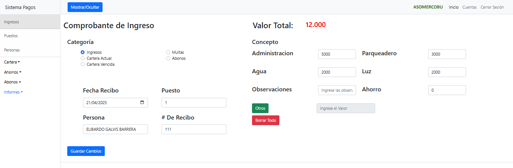
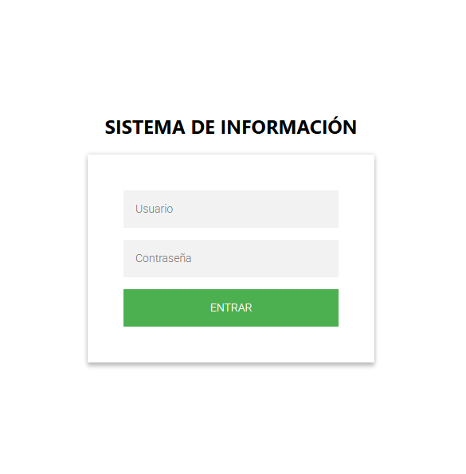
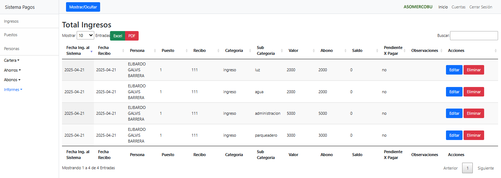
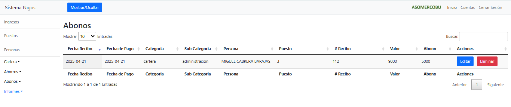
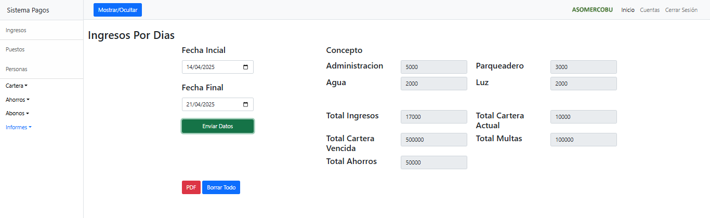
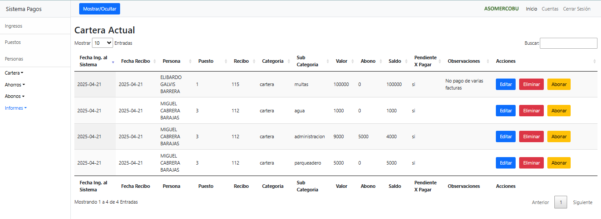
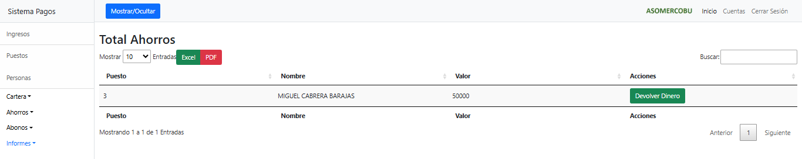

# 📊 Sistema de Gestión de Cartera

Aplicación web para la gestión de cartera, ingresos, abonos e informes financieros. Este sistema permite llevar un control detallado de los clientes, su saldo pendiente, y generar reportes con facilidad.

## 🚀 Tecnologías utilizadas

- **PHP** – Lógica del backend y manejo de sesiones
- **JavaScript** – Interactividad del frontend
- **Ajax** – Comunicación asincrónica con el servidor
- **MySQL** – Base de datos relacional para almacenar la información
- **HTML & CSS** – Estructura y estilos del frontend

## 🧰 Funcionalidades principales

- 📥 Registro y gestión de clientes
- 💵 Control de ingresos y abonos por cliente
- 📋 Listado de cartera con filtros
- 📈 Generación de informes
- 🔎 Búsqueda rápida y actualizaciones dinámicas con Ajax
  
## 📸 Capturas de pantalla

### 🏠 Pantalla de inicio

### 🔐 Login

### 💰 Registro de ingresos

### 💳 Abonos de ingresos

### 🧾 Reporte de abonos

### 📊 Reportes generales

### 🧑‍💼 Cartera por persona

### 📋 Cartera general

### 💵 Ahorros

